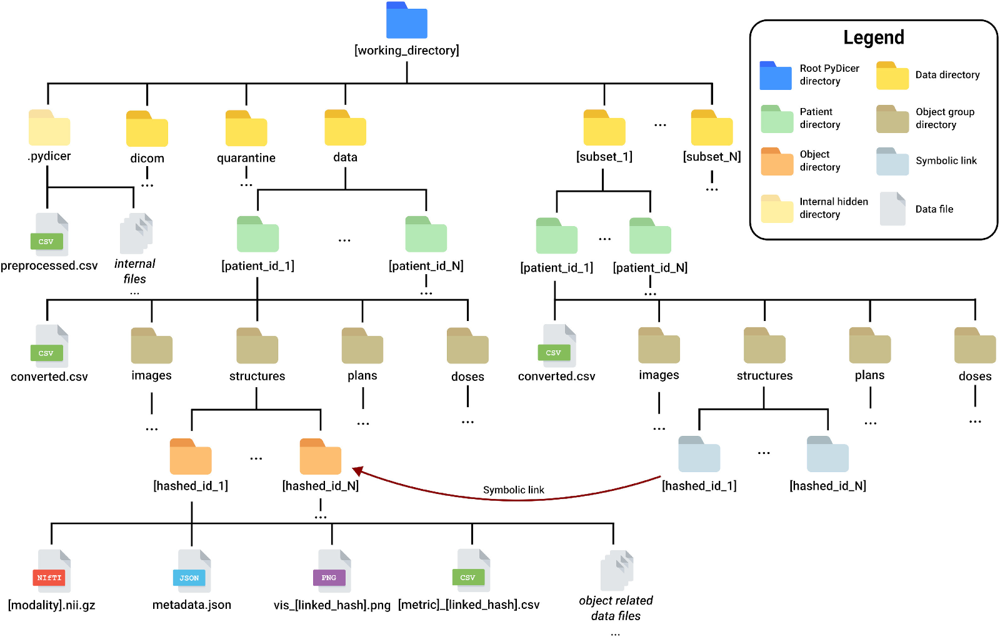

# PyDicer: PYthon Dicom Image ConvertER

[](https://doi.org/10.1016/j.softx.2024.102010)

Welcome to PyDicer, a tool to ease the process of converting Radiotherapy DICOM data objects into a format typically used for research purposes. In addition to data conversion, functionality is provided to help analyse the data. This includes computing radiomic features, radiotherapy dose metrics and auto-segmentation metrics. PyDicer uses the NIfTI format to store data is a well defined file system structure. Tracking of these data objects in CSV files, also stored on the file system, provides an easy and flexible way to work with the converted data in your research.

The [PyDicer documentation](https://australiancancerdatanetwork.github.io/pydicer/index.html) provides several examples and guides to help you get started with the tool. Here are a few **PyDicer principles** to keep in mind as you get started:

- The [working directory structure](https://australiancancerdatanetwork.github.io/pydicer/index.html#directory-structure) is standardised and generalisable for use with any DICOM dataset.
- Use [Pandas DataFrame's](https://pandas.pydata.org/docs/reference/api/pandas.DataFrame.html) to work with converted data objects.
- [SimpleITK](https://simpleitk.readthedocs.io/en/master/) and [PlatiPy](https://pyplati.github.io/platipy/) are used under the hood for the image conversion, visualisation and analysis tasks.
- Always inspect visualisations, plots and metrics produced by PyDicer in your working directory. Remember, PyDicer is a research tool so only use it for research purposes and expect the unexpected!

## Installation

PyDicer currently supports Python version 3.8, 3.9 and 3.10. Install PyDicer in your Python
environment using `pip`:

```bash
pip install pydicer
```

## Supported Modalities

PyDicer currently supports converting and analysing the following DICOM modalities:

- CT
- MR
- PT (Experimental)
- RTSTRUCT
- RTPLAN (Not converted since this only consists of meta data)
- RTDOSE

## Directory Structure

PyDicer will place converted and intermediate files into a specific directory structure. Visualisation, metrics computed and plots are also stored along side the converted data objects. Within the configured working directory `[working]`, the following directories will be generated:

- `[working]/data`: Directory in which converted data will be placed
- `[working]/quarantine`: Files which couldn't be preprocessed or converted will be placed in here for you to investigate further
- `[working]/.pydicer`: Intermediate files as well as log output will be stored in here
- `[working]/[dataset_name]`: Clean datasets prepared using the Dataset Preparation Module will be stored in a directory with their name and will symbolically link to converted in the `[working]/data` directory


*PyDicer working directory structure ([Chlap, P. et al. SoftwareX](https://doi.org/10.1016/j.softx.2024.102010))*

## Pipeline

The pipeline handles fetching of the DICOM data to conversion and preparation of your research dataset. Here are the key steps of the pipeline:

1. **Input**: various classes are provided to fetch DICOM files from the file system, DICOM PACS, TCIA or Orthanc. A TestInput class is also provided to supply test data for development/testing.

2. **Preprocess**: The DICOM files are sorted and linked. Error checking is performed and resolved where possible.

3. **Conversion**: The DICOM files are converted to the target format (NIfTI).

4. **Visualistion**: Visualistions of data converted are prepared to assist with data selection.

5. **Dataset Preparation**: The appropriate files from the converted data are selected to prepare a clean dataset ready for use in your research project!

6. **Analysis**: Radiomics and Dose Metrics are computed on the converted data.

## Getting Started

Running the pipeline is easy. The following script will get you started:

```python
from pathlib import Path

from pydicer.input.test import TestInput
from pydicer import PyDicer

# Configure working directory
directory = Path("./testdata")
directory.mkdir(exist_ok=True, parents=True)

# Fetch some test DICOM data to convert
dicom_directory = directory.joinpath("dicom")
dicom_directory.mkdir(exist_ok=True, parents=True)
test_input = TestInput(dicom_directory)
test_input.fetch_data()

# Create the PyDicer tool object and add the dicom directory as an input location
pydicer = PyDicer(directory)
pydicer.add_input(dicom_directory)

# Run the pipeline
pydicer.run_pipeline()
```

## How to Cite

If you find PyDicer useful in your research work, please consider citing our SoftwareX paper:

**Chlap P, Al Mouiee D, Finnegan RN, et al. PyDicer: An open-source python library for conversion and analysis of radiotherapy DICOM data. *SoftwareX*. 2025;[29:102010. doi:10.1016/j.softx.2024.102010](https://doi.org/10.1016/j.softx.2024.102010)**

## Contributing

PyDicer is an open-source tool and contributions are welcome! Here are some ways you might consider contributing to the project:

- Reporting issues on GitHub.
- Correcting/extending the documentation.
- Contributing a bug fix or extending some functionality.
- Providing functionality to support additional DICOM modalities.
- Giving the [PyDicer project](https://github.com/AustralianCancerDataNetwork/pydicer) a star on GitHub.

For more information, see the [Contributing documentation](https://australiancancerdatanetwork.github.io/pydicer/contributing.html).

## Authors

PyDicer was developed by the [Ingham Medical Physics team](https://www.unsw.edu.au/medicine-health/our-schools/clinical-medicine/research-impact/research-groups/cancer/ingham-medical-physics) in South-Western Sydney. It was developed as part of the [Australian Cancer Data Network](https://australian-cancer-data.network/) supported by the [Australian Research Data Commons](https://ardc.edu.au/).

- **Phillip Chlap** - [phillip.chlap@unsw.edu.au](phillip.chlap@unsw.edu.au)
- **Daniel Al Mouiee** - [d.almouiee@unsw.edu.au](d.almouiee@unsw.edu.au)
